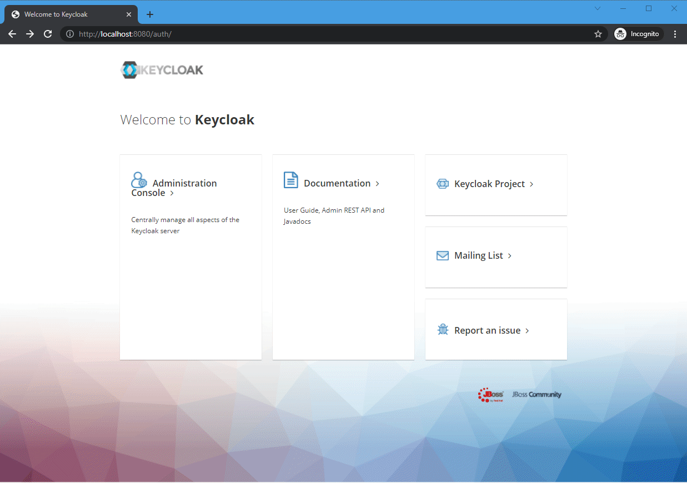

# Keycloak Custom User SPI with MS SQL Server Database

This repo contains a demo of Keycloak Custom User SPI (Service Provider Interface) that uses MS SQL Database.

More info can be found in my [blog post](https://blog.dusklight.com/2022/01/keycloak-custom-user-storage-spi-with-sql-server-database.html).

## Demonstrates the following features

* Allows Keycloak to access users stored in a custom MS SQL database.
* Allows configuring MS SQL connection from Keycloak's admin user interface.
* Exposes custom user data as attributes in Keycloak.
* Validates user passwords within the Custom User SPI, using the `pbkdf2` algorithm with the same hashing configuration as Keycloak's default values.  

## Try it out using docker-compose

* Run `docker-compose up` from the root folder.  This will:
  * Build the Custom User SPI using a maven image, then deploy it to the Keycloak image.
  * Spin up the MS SQL container and create a demo custom database with sample data and an empty Keycloak database.
  * Spin up the Keycloak container.
* Once all containers have started, login to Keycloak by going to https://localhost:8080
* Navigate to *User Federation*, and select `dusklight-database`.
  * Keycloak will show a screen where you can configure the SQL Server connection for the Custom User SPI.
  * Enter the following:
    * Database Server Host Name or IP: `mssql`
    * Database Name: `Dusklight`
    * Username: `sa`
    * Password: `Password!23`
      * Note that this password is not stored securely in Keycloak.  For production use, implement other means of storing this, or use Integrated Security. 
  * Click on the *Save* button.

The Custom User SPI should now have been added as a user federation in Keycloak.  To check if the users can be accessed in Keycloak, follow the steps below: 
* Navigate to *Users*.
* Click on *View all users* button.
* It should show two users from the database - [Alice and Bob](https://en.wikipedia.org/wiki/Alice_and_Bob).
* Click on the *Edit* button on one of the users, then navigate to *Attributes* tab.
* It should list the `department` attribute, which is sourced from the database and being exposed as a user attribute.

Here's the screen capture animation of the entire process:

# References

* Keycloak [documentation](https://www.keycloak.org/docs/15.0/server_development/#_user-storage-spi)
* Keycloak's official user-storage-jpa [quick-start](https://github.com/keycloak/keycloak-quickstarts/tree/15.0.2/user-storage-jpa)
* EAR packaging based on [thomasdarimont/keycloak-user-storage-provider-demo](https://github.com/thomasdarimont/keycloak-user-storage-provider-demo).
* [nt-ca-aqe/keycloak-user-storage](https://github.com/nt-ca-aqe/keycloak-user-storage)
